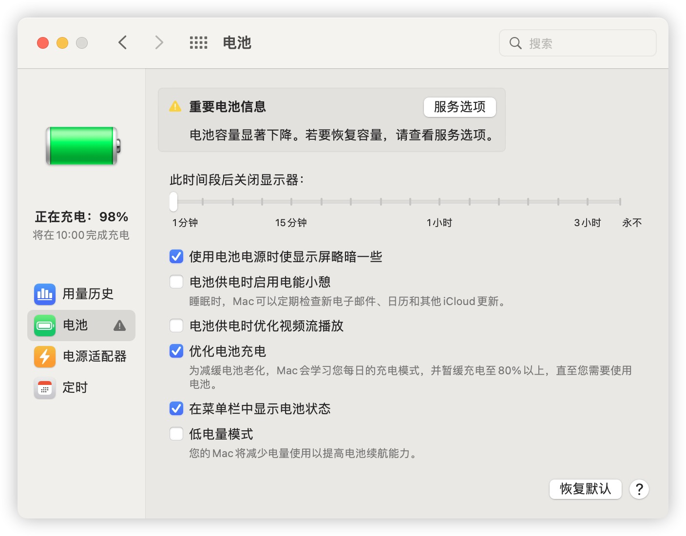
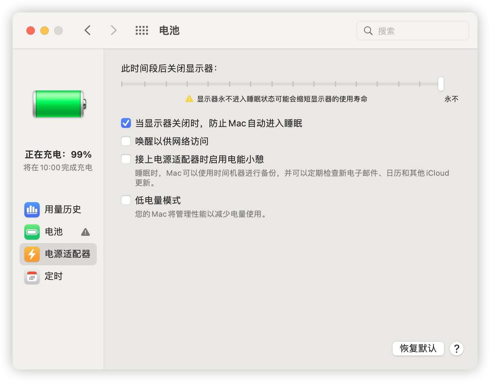
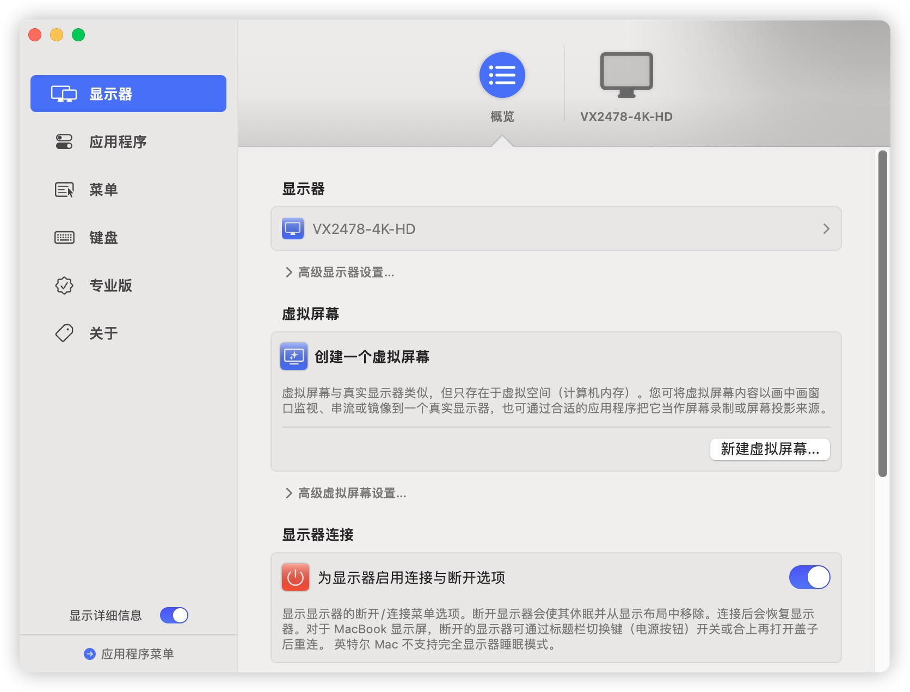

# macOS on RedmiBook Pro 15S
## 配置

Type | Spec
:---------|:---------
Model Name | RedmiBook Pro 15S 2021
CPU | AMD Ryzen™ 7 5600H
RAM | 16 GB 3200 MHz DDR4
Wi-Fi | Intel® Wi-Fi 6 AX200
Audio | Realtek ALC256

## 安装时需要关闭的驱动

驱动 | 
:---------|
AirportItlwm |
IntelBluetoothFirmware |
IntelBluetoothInjector | 
IntelBTPatcher | 
BlueToolFixup | 
NootedRed | 

> 当系统完全安装完毕时（系统激活完毕）将以上关闭驱动再次打开，如果你是5800H只需要修改AMD内核补丁即可。当前`OpenCore 1.0.1`


## 虚拟化问题
目前仅只有Monterey（mac os 12.x）以下版本支持VirtualBox。我只是用来安装Debian然后在里面安装docker完成项目的编译打包工作（内存只需要分配300MB），当然如果你有更复杂的操作可以考虑买一块RK3399开发版来满足你的需求，这两者目前我都有使用。

> 如果你不考虑虚拟化可以使用最新版本系统，目前`12.x`是解决虚拟化问题的最后一个版本

## 睡眠问题
通过ACPI补丁可以开启S3睡眠，但是会有些问题（第二个C口外界设备会导致秒醒）睡眠日志如下
```text
2024-09-03 09:52:49.341426+0800 0x75       Default     0x0                  0      0    kernel: (AppleACPIPlatform) AppleACPIPlatformPower Wake reason: GP17
2024-09-03 09:52:49.341427+0800 0x75       Default     0x0                  0      0    kernel: (AppleACPIPlatform) AppleACPIPlatformPower Wake reason: GP17
```
当前问题尚未能解决，如果改问题解决请联系我。


ACPI文件 | 作用
:---------|:---------
SSDT-BATT-fix | 修复电池循环
SSDT-BTIF.aml | 开启S3睡眠

> 这两个同时开启，电池百分比会用一段时间突然显示低电量（5%）实际上充电口是绿灯

电源设置



> 电池选项中请设置1分钟后睡眠，如果不设置在唤醒盒盖时内屏显示器无法关闭。

外接显示器用户，使用`BetterDisplay`软件来管理内屏显示体验会更加（由于我是4k显示器，红米这个本HDMI接口是残的只能4K30Hz体验太差了，无奈使用C to DP外接）


## 白果网卡
目前仅测试过两块白果网卡`BCM94360CS2`、`BCM94360Z4`这两块网卡蓝牙正常， WI-FI无法使用。在windows中网卡是正常使用，Hackintool能够识别PCIE地址但是无法使用Wi-Fi


## 感谢
[JokerAB](https://github.com/JokerAB)、`Lynx`、[维奇](https://github.com/weachy) 提供的帮助
